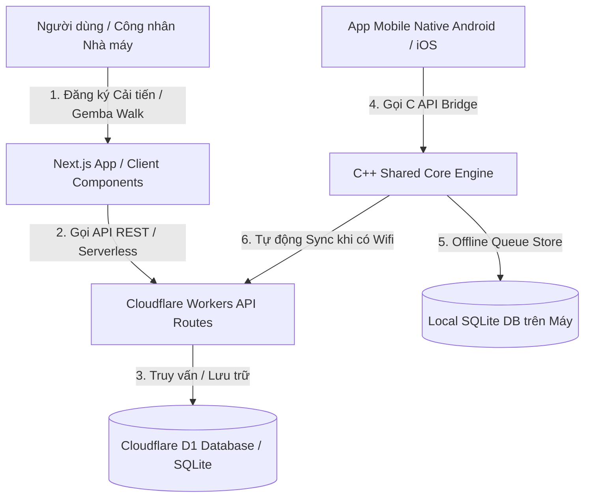

# 1. GIỚI THIỆU TỔNG QUAN

- **Tên dự án**: **TBS II Platform** (Hệ thống Số hóa & Quản trị Vận hành Sản xuất - Tổ hợp Kiên Giang - TBS Group)
- **Mục đích & Chức năng chính**: 
  Hệ thống quản trị số hóa tập trung dành cho chuỗi nhà máy sản xuất của Tập đoàn TBS Group (trọng tâm là **Tổ hợp Kiên Giang** bao gồm: **KG 1**, **KG 2**, và **Hoàn thiện đế**). Hệ thống hỗ trợ tiếp nhận & đánh giá đề xuất cải tiến Kaizen 5 bước, kiểm soát sự cố hiện trường Gemba Walk, quản lý bảo trì máy móc thiết bị (MMTB), theo dõi kế toán tài chính, nhân sự tuyển dụng và quản trị phân quyền đa cấp.
- **Đối tượng sử dụng**: 
  Nội bộ Tập đoàn TBS Group — Cán bộ quản lý, Công nhân nhà máy, Ban Giám Đốc, Ban Giám Khảo Kaizen, Kỹ sư CI, QC, Bảo trì thiết bị và Nhân sự.
- **Các phân hệ nghiệp vụ chính**:
  1. `00. Tổng quan`: Bảng điều khiển (Dashboard) chỉ số vận hành toàn chuỗi nhà máy.
  2. `01. Nhân sự – Hành chính`: Quản lý hồ sơ nhân viên, văn thư, tài sản & quy trình tuyển dụng.
  3. `02. Kế toán và tài chính`: Quản lý tài chính, ngân sách, công nợ, hóa đơn, thu chi & khấu hao tài sản.
  4. `03. R&D (Phát triển sản phẩm)`: Nghiên cứu công nghệ đế giày Skechers, thiết kế mẫu & chuyển giao kỹ thuật.
  5. `04. CN-CI (Cải tiến liên tục)`: Trung tâm quản trị Triển khai công nghệ, Hoạt động Kaizen/CI/Gemba, Quản lý MMTB & Bảo trì.
  6. `05. Quản lý chất lượng (QC)`: Kiểm soát tiêu chuẩn QC, chỉ số OEE & tỷ lệ lỗi sản xuất trên chuyền.
  7. `06. Kho & Logistics`: Quản lý vật tư kho & chuỗi cung ứng (*Trạng thái: Sắp ra mắt*).

---

# 2. CÔNG NGHỆ SỬ DỤNG (TECH STACK) — GHI RÕ VERSION

| Thành phần | Công nghệ | Version | Ghi chú |
|---|---|---|---|
| **Ngôn ngữ chính (Web/APIs)** | TypeScript / JavaScript | Node.js v22.x (>= 20.0.0) | Môi trường runtime chính |
| **C++ Core Engine** | C / C++ | C++17 (GNU 13.3.0 / CMake 3.14+) | Engine xử lý offline & JNI / Obj-C++ Bridge |
| **Mobile Native (Android)** | Kotlin / Jetpack Compose | Android NDK Side-by-side | Native Android app |
| **Mobile Native (iOS)** | Swift / SwiftUI / Obj-C++ | Swift 5.9 (iOS 15.0+) | Native iOS app |
| **Frontend Framework** | Next.js (App Router, Turbopack) | `16.2.11` | Khai báo trong `web/package.json` |
| **UI Library Core** | React / React-DOM | `19.2.4` | React 19 Server/Client Components |
| **Styling / CSS** | TailwindCSS / PostCSS | `^4.0.0` (`@tailwindcss/postcss`) | CSS Framework chính |
| **Backend Node Server** | Express.js | `^4.19.2` | Khai báo trong `backend/package.json` |
| **Backend Python Server** | Python FastAPI / Uvicorn | FastAPI `>=0.110.0`, Uvicorn `>=0.28.0` | Khai báo trong `backend/requirements.txt` |
| **Database Server** | SQLite / Cloudflare D1 | SQLite 3 (D1 Serverless Database) | Cơ sở dữ liệu sản xuất & local |
| **ORM / Query Builder** | Prisma ORM | `^5.12.1` | Khai báo trong `backend/package.json` |
| **State Management** | React Native Hooks / Local State | React 19 Standard Hooks | Quản lý state tập trung qua `useState`, `useMemo` |
| **Authentication & Tokens** | JOSE / PyJWT / bcryptjs | JOSE `^5.9.6`, bcryptjs `^2.4.3` | Mã hóa & xác thực JWT Session Serverless |
| **Build & Deploy Tool** | Turbopack / Next Build / Wrangler | Wrangler `4.120.0` | Deploy Serverless lên Cloudflare Workers |
| **Package Manager** | npm | `10.x` | Đọc từ `package-lock.json` lockfile version 3 |
| **Testing Framework** | Jest / Google Test (C++) | Jest `^29.7.0`, GTest `v1.14.0` | Khai báo trong `backend` & `core-cpp` |
| **Charting / Biểu đồ** | Chart.js / React-ChartJS-2 | Chart.js `^4.5.1`, react-chartjs-2 `^5.3.1` | Vẽ biểu đồ Dashboard Kaizen |
| **Bộ Icon Set** | Tabler Icons / Lucide React | `@tabler/icons-react` `^3.45.0`, `lucide-react` `^0.469.0` | Icon hệ thống giao diện |
| **Xuất Báo Cáo / Tài Liệu** | Docxtemplater / PizZip / XLSX / pdf-lib | docxtemplater `^3.50.0`, xlsx `^0.18.5`, pdf-lib `^1.17.1` | Xử lý file Excel, Word, PDF |
| **Animation Engine** | Motion (Framer Motion) | `^11.11.0` | Hiệu ứng chuyển động giao diện |

---

# 3. YÊU CẦU MÔI TRƯỜNG (PREREQUISITES)

- **Node.js**: Phiên bản tối thiểu Node.js `>= 20.0.0` (Khuyên dùng **Node.js v22.x LTS**).
- **Package Manager**: `npm` phiên bản `>= 10.0.0`.
- **C++ Compiler**: CMake `>= 3.14` và Trình biên dịch C++ hỗ trợ **C++17** (GCC 13+, Clang 15+, MSVC 2022+).
- **Python (Tùy chọn)**: Python `>= 3.10` (nếu chạy Backend FastAPI tại `backend/`).
- **Cloudflare CLI**: Wrangler CLI v4 (`npm install -g wrangler`).

### Danh sách Biến Môi Trường (Từ `.env.template` & `wrangler.jsonc`):

| Tên biến | Mục đích / Mô tả | Bắt buộc |
|---|---|---|
| `DATABASE_URL` | Chuỗi kết nối cơ sở dữ liệu SQLite (`sqlite:///./tbs2_factory.db`) | Có |
| `JWT_SECRET` / `JWT_SECRET_KEY` | Khóa bí mật dùng để tạo và mã hóa Session Token JWT | Có |
| `NEXT_PUBLIC_APP_URL` | URL công khai của trang web (`https://thkiengiangshoes.tbsgroup2026.workers.dev`) | Có |
| `PLC_API_KEY` | Khóa bảo mật xác thực kết nối truyền nhận dữ liệu IoT PLC nhà máy | Không |
| `ALLOWED_ORIGINS` | Danh sách tên miền được phép gọi API (CORS policy) | Có |
| `RATE_LIMIT_MAX_REQUESTS` | Giới hạn số lượng request tối đa trong cửa sổ thời gian | Không |
| `GROK_API_KEY` | API Key kết nối dịch vụ trí tuệ nhân tạo Grok AI (xAI) | Không |
| `CLOUDFLARE_ACCOUNT_ID` | Mã ID tài khoản Cloudflare dùng cho CI/CD deployment | Khi Deploy |
| `CLOUDFLARE_API_TOKEN` | API Token Cloudflare có quyền deploy Workers & D1 | Khi Deploy |

---

# 4. HƯỚNG DẪN CÀI ĐẶT & CHẠY DỰ ÁN

### Bước 1: Clone Repository
```bash
git clone https://github.com/tbsgroup2026/thkiengiangshoes.git
cd thkiengiangshoes
```

### Bước 2: Cài đặt Dependencies
Cài đặt cho toàn bộ các thư mục trong Monorepo:
```bash
# Cài đặt tại root
npm install

# Cài đặt cho phân hệ Web Frontend
cd web
npm install
cd ..
```

### Bước 3: Cấu hình File Môi trường
```bash
cp .env.template .env
```
*(Chỉnh sửa các giá trị `JWT_SECRET` và `DATABASE_URL` trong file `.env` nếu cần)*.

### Bước 4: Chạy Môi Trường Phát Triển (Development)
```bash
# Chạy riêng phân hệ Web (Next.js App)
cd web
npm run dev
# Mở trình duyệt truy cập: http://localhost:3000

# Hoặc chạy song song cả Web và Backend từ Root
npm run dev
```

### Bước 5: Build và Chạy Production
```bash
# Biên dịch tĩnh Next.js Web App
cd web
npm run build

# Deploy trực tiếp lên Cloudflare Workers Live
npx wrangler deploy
```

---

# 5. CẤU TRÚC THƯ MỤC DỰ ÁN (FOLDER STRUCTURE)

```
d:\Work\KG-KAIZEN/
├── .github/
│   └── workflows/                # Các kịch bản CI/CD GitHub Actions
│       ├── build-core-cpp-test.yml # Auto build & test C++ Core
│       ├── deploy-web.yml          # Auto build & deploy Next.js lên Cloudflare Workers
│       └── security-gate.yml       # Tự động quét bảo mật mã nguồn
├── android/                      # Mã nguồn App Native Android (Kotlin, Jetpack Compose)
├── backend/                      # Service API Backend (Express.js / FastAPI / Prisma ORM)
│   ├── prisma/                   # Prisma Database Schema & Migrations
│   ├── routers/                  # API Route Handlers
│   └── services/                 # Business Logic Services
├── core-cpp/                     # Engine C++ dùng chung cho Android & iOS (Offline Engine)
│   ├── include/                  # C++ Header files (tbs_core.h)
│   ├── src/                      # C++ Source code (tbs_core.cpp)
│   ├── tests/                    # Unit test Google Test (test_main.cpp)
│   └── CMakeLists.txt            # Cấu hình biên dịch CMake C++17
├── ios/                          # Mã nguồn App Native iOS (Swift, SwiftUI, Obj-C++)
├── ios-admin/                    # App iOS Native riêng cho Ban Giám Đốc / Admin
├── scripts/                      # Các kịch bản tiện ích (Security Scan, Excel Parser)
├── web/                          # Phân hệ Web Chính (Next.js 16 App Router)
│   ├── public/                   # Tài nguyên hình ảnh, biểu tượng tĩnh
│   ├── src/
│   │   ├── app/                  # Next.js App Router (Các trang & API Endpoints)
│   │   │   ├── api/              # Serverless API Routes (ci-kaizen, work, employees)
│   │   │   ├── admin/            # Trang quản trị hệ thống
│   │   │   ├── finance/          # Trang Kế toán & Tài chính
│   │   │   ├── hr/               # Trang Nhân sự & Tuyển dụng
│   │   │   ├── maintenance/      # Trang Bảo trì Máy móc Thiết bị
│   │   │   └── work/             # Trung tâm điều hành Phân hệ Nghiệp vụ (/work)
│   │   ├── components/           # Các UI Component dùng chung (Modal, Filter, Buttons)
│   │   ├── lib/                  # Thư viện dùng chung, Cấu hình Data, Permission Engine
│   │   │   ├── cnciData.ts       # Cấu hình danh mục 3 Thẻ Chức Năng CN-CI
│   │   │   ├── companyData.ts    # Cấu hình dữ liệu phòng ban & người dùng mẫu
│   │   │   └── permissionEngine.ts # Động cơ phân quyền người dùng & cấp bậc
│   │   └── modules/              # Các Module chức năng chính
│   │       ├── ci/               # Module Kaizen, CI, Gemba Walk & KaizenDetailModal
│   │       ├── hr/               # Module Quản lý Nhân sự & Văn thư
│   │       └── production/       # Module Điều hành Sản xuất
│   ├── next.config.ts            # Cấu hình Next.js (Static Export mode)
│   └── package.json              # Khai báo thư viện & scripts của Web App
├── .env.template                 # Template khai báo biến môi trường
├── PROJECT_STATE.md              # Báo cáo trạng thái dự án
├── DEPLOYMENT.md                 # Tài liệu hướng dẫn triển khai hệ thống
├── wrangler.jsonc                # Cấu hình Cloudflare Workers & Assets directory
└── README.md                     # Tài liệu hướng dẫn tổng quan dự án
```

---

# 6. BẢN ĐỒ CODE THEO CHỨC NĂNG (WHERE TO FIND WHAT)

| Phân hệ Nghiệp vụ | UI Component / Page | Logic / Service / Hook | Configuration Data | API Route Endpoint |
|---|---|---|---|---|
| **00. Tổng quan** | [web/src/app/work/page.tsx](file:///d:/Work/KG-KAIZEN/web/src/app/work/page.tsx) | `OverviewDashboard` in `work/page.tsx` | [companyData.ts](file:///d:/Work/KG-KAIZEN/web/src/lib/companyData.ts) | `/api/work/dashboard` |
| **01. Nhân sự – Hành chính** | [web/src/app/hr/page.tsx](file:///d:/Work/KG-KAIZEN/web/src/app/hr/page.tsx), [HRHanhChanhHubView.tsx](file:///d:/Work/KG-KAIZEN/web/src/modules/hr/HRHanhChanhHubView.tsx) | `HRHanhChanhHubView` module logic | `initialEmployees.ts`, `userProfiles.ts` | `/api/employees/lookup` |
| **02. Kế toán & Tài chính** | [web/src/app/finance/page.tsx](file:///d:/Work/KG-KAIZEN/web/src/app/finance/page.tsx) | Finance Sub-routes (Thu chi, Công nợ, Ngân sách) | `companyData.ts` | `/api/finance/*` *(Static/App)* |
| **03. R&D (Phát triển SP)** | [web/src/app/work/page.tsx](file:///d:/Work/KG-KAIZEN/web/src/app/work/page.tsx) | `RDModule` component logic | `deptBanners.rd` in `work/page.tsx` | N/A *(Embedded in Work Hub)* |
| **04. CN-CI (Cải tiến liên tục)** | [CNCIWrapper.tsx](file:///d:/Work/KG-KAIZEN/web/src/modules/ci/CNCIWrapper.tsx), [CIModule.tsx](file:///d:/Work/KG-KAIZEN/web/src/modules/ci/CIModule.tsx), [KaizenDetailModal.tsx](file:///d:/Work/KG-KAIZEN/web/src/modules/ci/KaizenDetailModal.tsx) | [organizationTree.ts](file:///d:/Work/KG-KAIZEN/web/src/modules/ci/organizationTree.ts), `permissionEngine.ts` | [cnciData.ts](file:///d:/Work/KG-KAIZEN/web/src/lib/cnciData.ts), `organizationTree.ts` | `/api/ci-kaizen`, `/api/ci-kaizen/expert-evaluations`, `/api/ci-kaizen/rate` |
| **05. Quản lý chất lượng (QC)** | [web/src/app/work/page.tsx](file:///d:/Work/KG-KAIZEN/web/src/app/work/page.tsx) | QC Dashboard metrics | `departments[05]` in `work/page.tsx` | N/A *(Tích hợp trong Dashboard)* |
| **06. Kho & Logistics** | [web/src/app/finance/vat-tu-kho/page.tsx](file:///d:/Work/KG-KAIZEN/web/src/app/finance/vat-tu-kho/page.tsx) | Placeholder "Coming Soon" (`hasData: false`) | `departments[06]` in `work/page.tsx` | N/A *(Đang phát triển)* |
| **Bảo trì Máy móc Thiết bị (MMTB)** | [web/src/app/maintenance/tickets/page.tsx](file:///d:/Work/KG-KAIZEN/web/src/app/maintenance/tickets/page.tsx), [machines/page.tsx](file:///d:/Work/KG-KAIZEN/web/src/app/maintenance/machines/page.tsx) | Ticket & Machine Maintenance logic | `CNCI_CARDS_DATA.mmtb-management` | `/api/maintenance/*` *(Static/App)* |
| **Gemba Walk Hiện Trường** | [web/src/app/work/gemba/page.tsx](file:///d:/Work/KG-KAIZEN/web/src/app/work/gemba/page.tsx) | `GembaDedicatedPage` state & filters | `organizationTree.ts` | `/api/work/gemba` |

---

# 7. KIẾN TRÚC HỆ THỐNG (ARCHITECTURE)

### 7.1 Mô hình Kiến trúc
Hệ thống TBS II sử dụng mô hình **Monorepo Hybrid Architecture**:
1. **Frontend Layer**: Next.js 16 (App Router) được biên dịch dạng **Static Export** (`output: 'export'`) và phát hành trên hạ tầng Serverless **Cloudflare Workers / Assets**.
2. **Core Layer (C++ Shared Core)**: Engine C++17 dùng chung được đóng gói thành thư viện tĩnh/động cho Android (JNI Bridge) và iOS (Objective-C++ Bridge), hỗ trợ lưu trữ cơ sở dữ liệu SQLite ngoại tuyến và tự động đồng bộ khi có kết nối mạng.
3. **Backend Service Layer**: Node.js Express & Python FastAPI phụ trợ cho các tác vụ lưu trữ D1, Prisma ORM, và kết nối IoT PLC nhà máy.

### 7.2 Sơ đồ Luồng Dữ liệu (Data Flow Diagram)



---

# 8. DATABASE / SCHEMA

Cơ sở dữ liệu sản xuất được thiết kế trên **SQLite / Cloudflare D1 Database** với các bảng biểu chính:

1. **`kaizen_proposals` / `KaizenProposal`**:
   - `id`: Mã GUID định danh đề xuất.
   - `code`: Mã đề xuất (VD: `CI-2026-08001`).
   - `title`, `category`, `before_description`, `after_solution`: Thông tin mô tả cải tiến.
   - `proposer_emp_code`, `proposer_name`, `proposer_position`: Thông tin người đề xuất.
   - `factory`, `region`, `department`: Đơn vị phân cấp (`KG 1`, `KG 2`, `Hoàn thiện đế`).
   - `score_points`, `sub_status`, `registration_type`: Điểm số, trạng thái (`CHỜ ĐÁNH GIÁ`, `ĐÃ ĐÁNH GIÁ`, `LƯU TRỦ`, `THI ĐỦA`).
2. **`kaizen_evaluations` / `expert_evaluations`**:
   - `proposal_id`: Khóa ngoại tham chiếu bài Kaizen.
   - `evaluator_emp_code`, `evaluator_name`: Thông tin Giám Khảo chấm điểm.
   - `score_points`, `comments`, `status`: Điểm barem 100đ, nhận xét và trạng thái xác nhận (`DRAFT` / `CONFIRMED`).
3. **`kaizen_assigned_judges`**:
   - Danh sách Ban Giám Khảo được phân công chấm điểm cho từng đề xuất Kaizen.
4. **`gemba_walks` / `GembaRecord`**:
   - Ghi nhận sự cố hiện trường: `walk_code`, `factory`, `department`, `line_name`, `issue_description`, `status`.

- **Vị trí file Schema / Model**:
  - Prisma Schema: [backend/prisma/schema.prisma](file:///d:/Work/KG-KAIZEN/backend/prisma/schema.prisma)
  - Python Models: [backend/models.py](file:///d:/Work/KG-KAIZEN/backend/models.py)
  - TypeScript Types: [web/src/modules/ci/CIModule.tsx](file:///d:/Work/KG-KAIZEN/web/src/modules/ci/CIModule.tsx)

---

# 9. AUTHENTICATION & PHÂN QUYỀN

### 9.1 Cơ chế Đăng nhập & Xác thực
- Xác thực qua **Session Token JWT** (mã hóa với thư viện `JOSE` ở Web và `PyJWT` / `jsonwebtoken` ở Backend).
- Đăng nhập qua MSNV và mật khẩu cá nhân tại `/login`.

### 9.2 Động cơ Phân quyền (Permission Engine)
- Hệ thống áp dụng phân quyền dựa trên Vai trò (**Role-Based Access Control - RBAC**) kết hợp Cấp bậc (**Level Rank** từ 1 đến 5):
  - **Level Rank >= 3** hoặc thuộc nhóm Role (`TONG_GIAM_DOC`, `PHO_TONG_GIAM_DOC`, `GIAM_DOC`, `PHO_GIAM_DOC`, `TRUONG_PHONG`, `CI_LEAD`, `QC`, `ADMIN`): Có quyền Ban Giám Khảo / Executive.
  - **Phân quyền Trang Chi Tiết Kaizen (`KaizenDetailModal.tsx`)**:
    - **Tab "Đánh giá chuyên môn"**: Chỉ hiển thị với các tài khoản được phân công làm Ban Giám Khảo cho đề xuất đó (`assignedJudges`) hoặc Ban Giám Đốc/Admin. Tài khoản không có quyền sẽ bị ẩn hoàn toàn tab này.
    - **Tab "Đánh giá thưởng"**: Chỉ hiển thị với tài khoản có quyền chấm điểm thưởng.
    - **API Security**: Mọi request chấm điểm trực tiếp qua API đều được xác thực lại ở phía server; nếu không có quyền sẽ bị từ chối với mã lỗi **HTTP 403 Forbidden**.

---

# 10. SCRIPTS HỮU ÍCH

### 10.1 Root Scripts (`/package.json`):
- `npm run build`: Chuyển vào thư mục `web`, cài dependencies và tiến hành build dự án Next.js.
- `npm run deploy`: Chuyển vào thư mục `web` và chạy kịch bản deploy `npx wrangler deploy` lên Cloudflare Workers.
- `npm run install-all`: Tự động cài đặt dependencies cho cả 2 phân hệ `backend` và `web`.
- `npm run dev`: Chuyển và chạy song song cả server backend và web client bằng `concurrently`.
- `npm run security-scan`: Chạy kịch bản kiểm tra an ninh mã nguồn (`scripts/security-scan.js`).

### 10.2 Web Scripts (`/web/package.json`):
- `npm run dev`: Khởi chạy Next.js Development Server tại địa chỉ `http://localhost:3000`.
- `npm run build`: Khởi chạy `next build` biên dịch dự án ra thư mục tĩnh `web/out`.
- `npm run start`: Chạy Next.js Production Server.
- `npm run lint`: Chạy ESLint kiểm tra lỗi mã nguồn TypeScript/JSX.

---

# 11. DEPLOYMENT

### 11.1 Cấu hình Cloudflare Workers (`wrangler.jsonc`)
Tệp [wrangler.jsonc](file:///d:/Work/KG-KAIZEN/wrangler.jsonc) định nghĩa thông tin phát hành:
```jsonc
{
  "name": "thkiengiangshoes",
  "compatibility_date": "2024-09-23",
  "compatibility_flags": ["nodejs_compat"],
  "assets": {
    "directory": "web/out"
  },
  "vars": {
    "NEXT_PUBLIC_APP_URL": "https://thkiengiangshoes.tbsgroup2026.workers.dev",
    "JWT_SECRET": "tbs_group_secure_jwt_secret_key_2026"
  }
}
```

### 11.2 Kịch bản CI/CD GitHub Actions (`.github/workflows/deploy-web.yml`)
Khi có thao tác `git push` hoặc merge vào nhánh `main` làm thay đổi thư mục `web/`, kịch bản CI/CD sẽ tự động:
1. Checkout mã nguồn (`actions/checkout@v4`).
2. Thiết lập môi trường Node.js v22 (`actions/setup-node@v4`).
3. Chạy `npm ci` và `npm run build` tạo thư mục `web/out`.
4. Gọi lệnh `npx wrangler deploy` đẩy ứng dụng lên tên miền live **thkiengiangshoes.tbsgroup2026.workers.dev**.

---

# 12. GHI CHÚ / TODO / HẠN CHẾ HIỆN TẠI

1. **Phân hệ Kho & Logistics (`06. Kho & Logistics`)**: 
   - Đang đặt cờ `hasData: false` ("Coming soon"), dự kiến phát triển giao diện quản lý nhập xuất kho chi tiết ở giai đoạn tiếp theo.
2. **Chế độ Static Export của Next.js**:
   - Ứng dụng Web đang chạy chế độ `output: 'export'` để tương thích tối đa với Cloudflare Workers Static Assets. Các API Route động đòi hỏi môi trường Serverless Function của Cloudflare.
3. **Phạm vi Đơn vị**:
   - Hệ thống đã được chuẩn hóa và giới hạn phạm vi tác nghiệp tại **3 đơn vị chính**: `KG 1`, `KG 2`, và `Hoàn thiện đế`.

---

# 13. SKILL AGENT BỔ TRỢ (AI CODING SKILLS)

Mục này mô tả các "Skill" (bộ kịch bản / hướng dẫn chuyên biệt) hỗ trợ các AI Coding Agent (Antigravity, Claude Code, Cursor, Codex...) làm việc chính xác và hiệu quả nhất với codebase của hệ thống **TBS II Platform**.

## 13.1. Scan skill hiện có trong dự án

Dự án hiện tại đã được trang bị **13 AI Skill Agents** chuyên biệt nằm tại thư mục `.agents/skills/`:

| Tên Skill | Đường dẫn file | Mục đích & Mô tả chức năng |
|---|---|---|
| `brandkit` | [.agents/skills/brandkit/SKILL.md](file:///d:/Work/KG-KAIZEN/.agents/skills/brandkit/SKILL.md) | Bộ hướng dẫn tạo hình ảnh bộ nhận diện thương hiệu (Brandkit), thiết kế logo & identity system chuẩn TBS Group. |
| `design-taste-frontend` | [.agents/skills/design-taste-frontend/SKILL.md](file:///d:/Work/KG-KAIZEN/.agents/skills/design-taste-frontend/SKILL.md) | Tiêu chuẩn thiết kế UI/UX hiện đại (v2), phòng chống giao diện mẫu AI generic, tối ưu spacing, typography & micro-motion. |
| `design-taste-frontend-v1` | [.agents/skills/design-taste-frontend-v1/SKILL.md](file:///d:/Work/KG-KAIZEN/.agents/skills/design-taste-frontend-v1/SKILL.md) | Phiên bản v1 giữ tính tương thích ngược cho các giao diện kế thừa. |
| `full-output-enforcement` | [.agents/skills/full-output-enforcement/SKILL.md](file:///d:/Work/KG-KAIZEN/.agents/skills/full-output-enforcement/SKILL.md) | Ép buộc AI tạo mã nguồn đầy đủ 100%, cấm tuyệt đối mã giả (placeholder) hoặc bỏ dở đoạn code. |
| `gpt-taste` | [.agents/skills/gpt-taste/SKILL.md](file:///d:/Work/KG-KAIZEN/.agents/skills/gpt-taste/SKILL.md) | Hướng dẫn bố cục AIDA, Bento Grid, cuộn trang GSAP ScrollTrigger & hiệu ứng chuyển động chuyên sâu. |
| `high-end-visual-design` | [.agents/skills/high-end-visual-design/SKILL.md](file:///d:/Work/KG-KAIZEN/.agents/skills/high-end-visual-design/SKILL.md) | Định nghĩa các font chữ cao cấp, hiệu ứng đổ bóng, thẻ card sang trọng, nâng cấp thẩm mỹ UI. |
| `image-to-code` | [.agents/skills/image-to-code/SKILL.md](file:///d:/Work/KG-KAIZEN/.agents/skills/image-to-code/SKILL.md) | Quy trình chuyển đổi từ hình ảnh thiết kế sang mã nguồn React/Tailwind chuẩn xác từng pixel. |
| `imagegen-frontend-mobile` | [.agents/skills/imagegen-frontend-mobile/SKILL.md](file:///d:/Work/KG-KAIZEN/.agents/skills/imagegen-frontend-mobile/SKILL.md) | Hướng dẫn AI tạo hình ảnh tham chiếu giao diện Mobile App (iOS / Android mockups). |
| `imagegen-frontend-web` | [.agents/skills/imagegen-frontend-web/SKILL.md](file:///d:/Work/KG-KAIZEN/.agents/skills/imagegen-frontend-web/SKILL.md) | Quy trình tạo ảnh tham chiếu từng section độc lập cho landing page & web app. |
| `industrial-brutalist-ui` | [.agents/skills/industrial-brutalist-ui/SKILL.md](file:///d:/Work/KG-KAIZEN/.agents/skills/industrial-brutalist-ui/SKILL.md) | Phong cách giao diện công nghiệp cơ khí (Swiss Typographic + Military Terminal) cho bảng điều khiển dữ liệu lớn. |
| `minimalist-ui` | [.agents/skills/minimalist-ui/SKILL.md](file:///d:/Work/KG-KAIZEN/.agents/skills/minimalist-ui/SKILL.md) | Giao diện phong cách tạp chí tối giản, tông màu đơn sắc thanh lịch & flat bento grid. |
| `redesign-existing-projects` | [.agents/skills/redesign-existing-projects/SKILL.md](file:///d:/Work/KG-KAIZEN/.agents/skills/redesign-existing-projects/SKILL.md) | Quy trình tái thiết kế & nâng cấp giao diện dự án hiện có mà không làm hỏng logic nghiệp vụ cũ. |
| `stitch-design-taste` | [.agents/skills/stitch-design-taste/SKILL.md](file:///d:/Work/KG-KAIZEN/.agents/skills/stitch-design-taste/SKILL.md) | Hệ thống Semantic Design System cho Google Stitch, kiểm soát hiệu năng phần cứng & micro-motion. |

## 13.2. Đề xuất Skill Agent nên tạo cho dự án này

Dựa trên cấu trúc hệ thống Monorepo đặc thù với nhiều phân hệ nghiệp vụ (`00` - `06`, Kaizen, Gemba Walk, MMTB, Tài chính, Tuyển dụng...), dưới đây là **5 Skill Agent bổ trợ được đề xuất tạo thêm**:

### 1. **Skill: `add-business-module`**
- **Mục đích**: Tự động thêm 1 phân hệ nghiệp vụ mới vào thanh sidebar, khai báo cờ dữ liệu, tạo cấu trúc file (`/web/src/modules/<tên-module>`, `/web/src/app/<tên-module>`) đúng pattern hiện có của dự án.
- **Trigger**: Khi người dùng yêu cầu: *"Thêm phân hệ mới"*, *"Thêm module X vào sidebar"*, *"Tạo trang chức năng Y"*.
- **Thao tác trên các file/thư mục**:
  - [web/src/app/work/page.tsx](file:///d:/Work/KG-KAIZEN/web/src/app/work/page.tsx) *(Mảng `departments` & icon import)*
  - `web/src/modules/<tên-module>/` *(Tạo mới thư mục & component wrapper)*
  - [web/src/lib/companyData.ts](file:///d:/Work/KG-KAIZEN/web/src/lib/companyData.ts) *(Khai báo config banner & data)*

### 2. **Skill: `edit-feature-card`**
- **Mục đích**: Sửa nội dung thẻ nhóm chức năng (Tiêu đề, mô tả, icon, danh sách mục con, liên kết route) trong bất kỳ phân hệ nghiệp vụ nào mà không bị phá vỡ bố cục grid responsive.
- **Trigger**: Khi người dùng yêu cầu: *"Sửa nội dung thẻ"*, *"Đổi icon cho thẻ X"*, *"Thêm mục con vào thẻ Y"*.
- **Thao tác trên các file/thư mục**:
  - [web/src/lib/cnciData.ts](file:///d:/Work/KG-KAIZEN/web/src/lib/cnciData.ts) *(Dữ liệu nhóm thẻ CN-CI)*
  - [web/src/app/work/page.tsx](file:///d:/Work/KG-KAIZEN/web/src/app/work/page.tsx) *(Thẻ các phân hệ Tổng quan, R&D, QC)*
  - `web/src/modules/ci/CNCIWrapper.tsx` *(Render layout thẻ)*

### 3. **Skill: `sync-readme`**
- **Mục đích**: Tự động cập nhật lại file `README.md` (đặc biệt là Mục 6 - Bản đồ code theo chức năng & Mục 2 - Tech Stack) mỗi khi dự án thêm phân hệ mới hoặc thay đổi cấu trúc mã nguồn.
- **Trigger**: Sau khi hoàn thành cập nhật lớn về cấu trúc code hoặc khi người dùng yêu cầu: *"Cập nhật README"*, *"Sync documentation"*.
- **Thao tác trên các file/thư mục**:
  - [README.md](file:///d:/Work/KG-KAIZEN/README.md)
  - Quét toàn bộ thư mục `web/src/` & `backend/`

### 4. **Skill: `api-route-checker`**
- **Mục đích**: Quét và kiểm tra tính hợp lệ của tất cả các liên kết route, nút bấm, và API endpoints trong hệ thống; phát hiện liên kết chết (404), cờ placeholder chưa hoàn thiện hoặc thiếu kiểm tra xác thực JWT/RBAC.
- **Trigger**: Khi người dùng yêu cầu: *"Kiểm tra route"*, *"Audit link"*, *"Check API trước khi deploy"*.
- **Thao tác trên các file/thư mục**:
  - `web/src/app/api/` *(Tất cả serverless API routes)*
  - `web/src/app/` *(Tất cả trang Next.js App Router)*

### 5. **Skill: `design-consistency-check`**
- **Mục đích**: Đảm bảo các component mới thêm vào tuân thủ đúng hệ thống thiết kế hiện có (màu xanh thương hiệu `#006838`, bo góc `rounded-2xl`, hiệu ứng shadow, typography font Inter/Roboto và quy chuẩn responsive cho màn hình laptop nhỏ).
- **Trigger**: Khi người dùng thêm UI mới hoặc yêu cầu: *"Kiểm tra đồng bộ giao diện"*, *"Fix layout responsive"*.
- **Thao tác trên các file/thư mục**:
  - `web/src/components/`
  - `web/src/modules/`
  - [web/src/app/globals.css](file:///d:/Work/KG-KAIZEN/web/src/app/globals.css)

## 13.3. Hướng dẫn tạo skill mới cho AI Agent

Đối với các AI Coding Agent hỗ trợ chuẩn **Skill** (Antigravity, Claude Code,...), cấu trúc tạo 1 skill mới như sau:

- **Vị trí đặt file**: `.agents/skills/<ten-skill>/SKILL.md` (hoặc `.claude/skills/<ten-skill>/SKILL.md`)
- **Cấu trúc tối thiểu của file `SKILL.md`**:
```markdown
---
name: ten-skill-viết-thường
description: Mô tả ngắn gọn chức năng của skill và các từ khóa trigger để agent tự động nhận diện.
---

# Hướng dẫn chi tiết cho Agent
1. Các bước thực hiện bài bản...
2. Các file cần kiểm tra và chỉnh sửa...
3. Các quy tắc cấm/bắt buộc tuân thủ...
```
- **Cơ chế tự động phát hiện**: Khi người dùng đưa ra yêu cầu có ngữ cảnh phù hợp với phần `description` trong YAML frontmatter, AI Agent sẽ tự động nạp file `SKILL.md` tương ứng và thực thi theo đúng quy trình đã được định nghĩa.

---

### DANH SÁCH CÁC FILE ĐÃ ĐỌC ĐỂ TỔNG HỢP README NÀY:

1. [package.json](file:///d:/Work/KG-KAIZEN/package.json) *(Khai báo scripts root & dependencies monorepo)*
2. [web/package.json](file:///d:/Work/KG-KAIZEN/web/package.json) *(Phiên bản Next.js, React, Tailwind, Tabler Icons, Chart.js)*
3. [backend/package.json](file:///d:/Work/KG-KAIZEN/backend/package.json) *(Phiên bản Express, Prisma, Bull, Firebase Admin)*
4. [backend/requirements.txt](file:///d:/Work/KG-KAIZEN/backend/requirements.txt) *(Phiên bản FastAPI, Uvicorn, SQLAlchemy)*
5. [.env.template](file:///d:/Work/KG-KAIZEN/.env.template) *(Biến môi trường template)*
6. [wrangler.jsonc](file:///d:/Work/KG-KAIZEN/wrangler.jsonc) *(Cấu hình tên worker thkiengiangshoes & assets directory)*
7. [core-cpp/CMakeLists.txt](file:///d:/Work/KG-KAIZEN/core-cpp/CMakeLists.txt) *(Cấu hình C++17 Core Engine)*
8. [.github/workflows/deploy-web.yml](file:///d:/Work/KG-KAIZEN/.github/workflows/deploy-web.yml) *(Kịch bản tự động CI/CD deployment)*
9. [web/src/app/work/page.tsx](file:///d:/Work/KG-KAIZEN/web/src/app/work/page.tsx) *(Danh sách 7 phân hệ nghiệp vụ chính)*
10. [web/src/lib/cnciData.ts](file:///d:/Work/KG-KAIZEN/web/src/lib/cnciData.ts) *(Cấu hình dữ liệu nhóm thẻ phân hệ CN-CI)*
11. [web/src/modules/ci/organizationTree.ts](file:///d:/Work/KG-KAIZEN/web/src/modules/ci/organizationTree.ts) *(Cơ cấu tổ chức nhà máy KG 1, KG 2, Hoàn thiện đế)*
12. [web/src/modules/ci/KaizenDetailModal.tsx](file:///d:/Work/KG-KAIZEN/web/src/modules/ci/KaizenDetailModal.tsx) *(Phân quyền Ban Giám Khảo & ẩn tab chuyên môn)*
13. [.agents/skills/](file:///d:/Work/KG-KAIZEN/.agents/skills) *(Danh sách 13 AI Skill Agents hiện có)*
14. [DEPLOYMENT.md](file:///d:/Work/KG-KAIZEN/DEPLOYMENT.md) *(Tài liệu hướng dẫn deployment)*
15. [PROJECT_STATE.md](file:///d:/Work/KG-KAIZEN/PROJECT_STATE.md) *(Trạng thái tổng quan hệ thống)*
