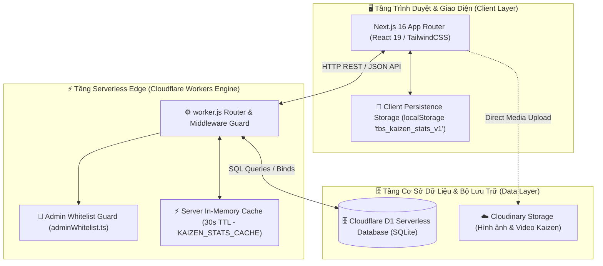
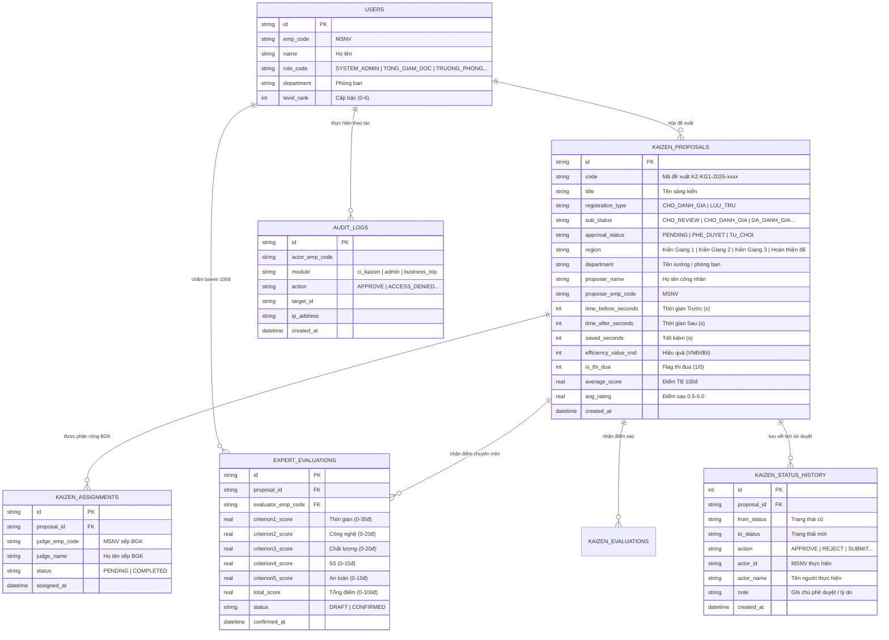
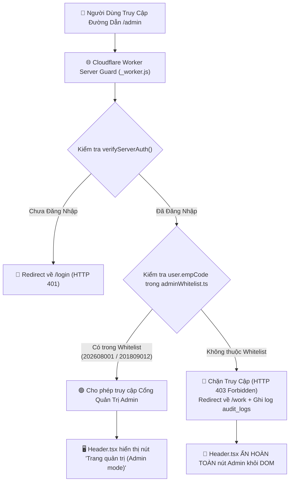

# 🏢 TBS II PLATFORM — HỆ THỐNG SỐ HÓA & QUẢN TRỊ VẬN HÀNH SẢN XUẤT TỔ HỢP KIÊN GIANG

> **Tài liệu Kỹ thuật & Kiến trúc Tổng thể Hệ thống (Master Architecture Documentation)**  
> **Đơn vị phát triển**: Ban Công Nghệ & Kaizen — Tập đoàn TBS Group  
> **Hạ tầng chính**: Cloudflare Workers (Serverless Engine) + Cloudflare D1 (SQLite Database) + Next.js 16 (Static Export)  
> **Phạm vi tác nghiệp**: Tổ hợp Nhà máy Kiên Giang (KG 1, KG 2, Hoàn thiện đế) & VP Chuỗi  

---

## 📋 1. GIỚI THIỆU HỆ THỐNG (SYSTEM OVERVIEW)

### 1.1 Mục Đích & Chức Năng Chính
**TBS II Platform** là hệ thống phần mềm quản trị sản xuất số hóa tập trung được thiết kế dành riêng cho đội ngũ cán bộ quản lý, kỹ sư CI/QC, bảo trì, ban giám khảo và công nhân trực tiếp sản xuất tại các nhà máy thuộc Tập đoàn TBS Group.

Hệ thống cung cấp các bộ công cụ toàn diện:
- **Phân hệ CN-CI (Kaizen 5 Bước & Gemba Walk)**: Quản lý toàn bộ vòng đời sáng kiến cải tiến từ đăng ký ý tưởng, sơ duyệt, phê duyệt triển khai (Bước 3), thực thi (Bước 4), đến đánh giá chuyên môn barem 100đ / chấm sao (Bước 5) và tôn vinh thi đua.
- **Bảng Điều Khiển Vận Hành (Dashboard & Cảnh báo Ban 2.2)**: Thống kê chỉ số Kaizen toàn nhà máy và cảnh báo sớm các vấn đề hiện trường.
- **Phân hệ Quản Lý Bảo Trì MMTB**: Tiếp nhận ticket sự cố máy móc và quản lý danh mục thiết bị sản xuất.
- **Phân hệ Kế Toán - Tài Chính & Hành Chính Nhân Sự**: Theo dõi hồ sơ cán bộ công nhân viên, thu chi, công nợ, ngân sách và lịch công tác.
- **Cổng Quản Trị Hệ Thống (Admin Portal)**: Phân quyền vai trò, quản lý đối tác thương hiệu và kiểm soát an ninh truy cập nghiêm ngặt.

---

## 🏗️ 2. KIẾN TRÚC TỔNG THỂ (HIGH-LEVEL ARCHITECTURE)

Sơ đồ Mermaid dưới đây mô tả kiến trúc phân lớp thực tế của hệ thống TBS II Platform:



---

## 📐 3. SƠ ĐỒ THỰC THỂ QUAN HỆ CSDL (D1 DATABASE ERD)

Toàn bộ dữ liệu sản xuất được lưu trữ trong CSDL Cloudflare D1 (`vpchuoiskechers`). Sơ đồ Mermaid ERD mô tả các bảng chính và mối quan hệ:



---

## 🔐 4. PHÂN QUYỀN HỆ THỐNG & ADMIN WHITELIST GUARD

### 4.1 Danh Sách Quyền Hạn (Role-Based Access Control - RBAC)

| Vai Trò (Role Code) | Mô Tả | Quyền Hạn Chi Tiết |
| :--- | :--- | :--- |
| **`SYSTEM_ADMIN`** | Quản trị viên hệ thống | Quản trị toàn quyền, phân công BGK, duyệt nhãn Thi đua, truy cập Admin Portal (`/admin`). |
| **`TONG_GIAM_DOC` / `BGĐ`** | Ban Giám Đốc / TGĐ | Xem toàn bộ báo cáo Dashboard, phân công BGK, phê duyệt cấp cao. |
| **`TRUONG_PHONG` / `P.GĐ`** | Trưởng phòng / Phó GĐ nhà máy | Phê duyệt triển khai Bước 3 (`PHE_DUYET`/`TU_CHOI`), nhập số liệu thời gian Trước/Sau. |
| **`TEAM_CI` / `BGK`** | Hội đồng Ban Giám Khảo Kaizen | Đánh giá hiệu quả Bước 5 (Đạt / Không đạt), chấm điểm barem 100đ / chấm sao, gắn nhãn Thi đua. |
| **`WORKER` / `EMPLOYEE`** | Công nhân / Nhân viên | Nộp đề xuất sáng kiến mới, theo dõi trạng thái đề xuất cá nhân, bình chọn bài viết. |

---

### 4.2 Sơ Đồ Kiểm Soát An Ninh Trang Admin (`/admin`)

Hệ thống bảo mật 2 lớp (Lớp Giao diện & Lớp Server Guard):



> **Whitelist Cố Định Hiện Tại** (`web/src/lib/adminWhitelist.ts`):
> 1. **Phạm Nguyễn Anh Huy** (MSNV: `202608001` — Vai trò: Admin)
> 2. **Kiều Thanh Vũ** (MSNV: `201809012` — Vai trò: Phó Giám Đốc)

---

## 📑 5. BẢN ĐỒ THƯ MỤC VÀ TÀI LIỆU CHI TIẾT (DOCUMENTATION INDEX)

Để tránh quá tải nội dung trong một file duy nhất, bộ tài liệu được chia thành các tài liệu chuyên biệt:

| Tên Tài Liệu | Vị Trí Tệp | Nội Dung Trọng Tâm |
| :--- | :--- | :--- |
| 🔄 **Vòng Đời & State Machine Kaizen** | [`docs/MODULE_KAIZEN_STATE_MACHINE.md`](file:///d:/Work/KG-KAIZEN/docs/MODULE_KAIZEN_STATE_MACHINE.md) | Sơ đồ chuyển đổi trạng thái 5 bước (`stateDiagram-v2`), Sequence Diagram phê duyệt, chấm điểm barem 100đ & SWR hydration F5. |
| ⚙️ **API Reference & Database Schema** | [`docs/SYSTEM_ARCHITECTURE_API_REFERENCE.md`](file:///d:/Work/KG-KAIZEN/docs/SYSTEM_ARCHITECTURE_API_REFERENCE.md) | Bảng tra cứu toàn bộ 17 API endpoints trong `_worker.js`, cấu trúc CSDL D1 và mô tả kiến trúc Cache đa tầng. |
| ⚡ **Sidebar Badge Stats & Cache Architecture** | [`web/src/modules/ci/README.md`](file:///d:/Work/KG-KAIZEN/web/src/modules/ci/README.md) | Chi tiết tối ưu tốc độ badge Sidebar, Server Cache 30s + Invalidate theo sự kiện & Client `localStorage` SWR. |

---

## 🚀 6. HƯỚNG DẪN CÀI ĐẶT & CHẠY DỰ ÁN (GETTING STARTED)

### 6.1 Yêu Cầu Môi Trường
- **Node.js**: Phiên bản `>= 20.0.0` (Khuyên dùng Node.js v22 LTS).
- **Package Manager**: `npm` v10+.
- **Wrangler CLI**: `wrangler` v4 (`npm install -g wrangler`).

### 6.2 Các Bước Thực Hiện
```bash
# 1. Clone kho lưu trữ
git clone https://github.com/tbsgroup2026/thkiengiangshoes.git
cd thkiengiangshoes

# 2. Cài đặt Dependencies cho phân hệ Web
cd web
npm install

# 3. Chạy môi trường Local Development Server
npm run dev
# Mở trình duyệt tại: http://localhost:3000

# 4. Kiểm tra lỗi TypeScript trước khi deploy
npx tsc --noEmit

# 5. Build ứng dụng tĩnh và deploy lên Cloudflare Workers
npm run build
npx wrangler deploy --name thkiengiangshoes
```

---

## ⚠️ 7. GIỚI HẠN HIỆN TẠI & NHỮNG ĐIỂM CHƯA XÁC ĐỊNH

### 7.1 Giới Hạn Hiện Tại (Known Limitations)
- **Đồng bộ đa tab (Multi-tab Sync)**: Trường hợp mở cùng lúc 2 tab trình duyệt, việc nộp bài ở Tab 1 sẽ cập nhật lập tức badge ở Tab 1; Tab 2 sẽ thấy badge mới sau lượt tương tác tiếp theo hoặc khi bấm refresh.

### 7.2 Những Phần Chưa Xác Định — Cần Bổ Sung (Undefined Areas)
- **Phân hệ Kho & Logistics (`06. Kho & Logistics`)**: Hiện tại đang hiển thị giao diện chờ phát triển ("Coming Soon"), chưa có schema bảng CSDL D1 chính thức.
- **Tích hợp IoT PLC Máy Móc Trực Tiếp**: Mới chỉ hỗ trợ quản lý Ticket bảo trì MMTB; chưa có cổng websocket nhận dữ liệu cảm biến trực tiếp theo thời gian thực từ dây chuyền nhà máy.

---

> **Tài liệu Kỹ thuật Tổng thể Ban Hành Ngày**: `28/08/2026`  
> **Tác giả**: AI Agent Pair Programming & Ban Công Nghệ TBS Group
